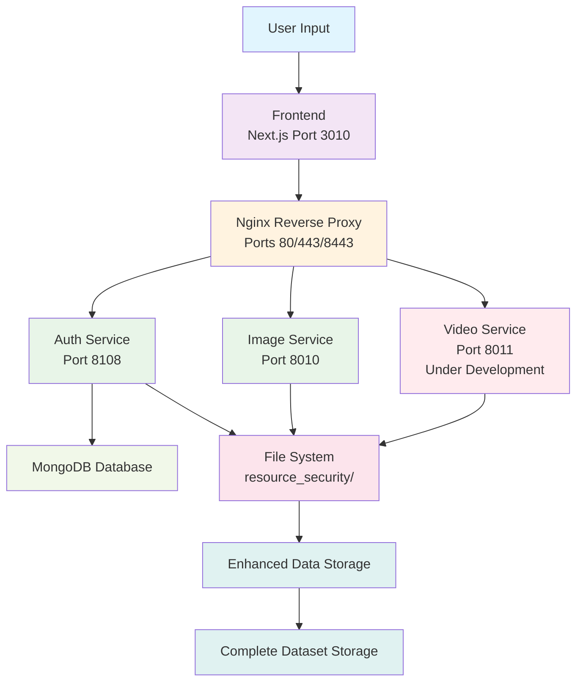

# Eye Tracking System - Architecture Sequence Diagram

This document provides a comprehensive time sequence diagram showing the overall service interactions and API flow in the Eye Tracking Web Application.

## System Architecture Overview

The system follows a microservices architecture with the following components:
- **Frontend (Next.js)**: Port 3010 - User interface and API gateway
- **Nginx Reverse Proxy**: Ports 80, 443, 8443 - Load balancing and SSL termination
- **Auth Service (FastAPI)**: Port 8108 - User authentication and data management
- **Image Service (FastAPI)**: Port 8010 - AI image processing and analysis
- **Video Service**: Port 8011 - Currently under development
- **MongoDB**: Database for user data and session management

## Time Sequence Diagram

## Key Service Interactions

### 1. Authentication Flow
- User consent management through Auth Service
- JWT-based session management
- User preference storage in MongoDB

### 2. Data Collection Flow
- Real-time webcam frame processing via Image Service
- Concurrent file saving through Auth Service
- User-specific directory structure in `resource_security/public/captures/`

### 3. Image Processing Flow
- Batch processing through Image Service
- AI face enhancement using Real-ESRGAN
- Enhanced images stored in `resource_security/public/enhance/`

### 4. Admin Operations Flow
- Secure admin authentication
- Dataset viewing and management
- Bulk data download and export

### 5. Error Handling
- Graceful degradation when services are unavailable
- Mock responses for development/testing
- Comprehensive error logging and monitoring

## API Endpoints Summary

### Frontend API Routes (`/pages/api/`)
- `save-capture.js` - Save user capture data
- `process-image.js` - Process single images
- `process-frame.js` - Real-time frame processing
- `check-backend-connection.js` - Health monitoring
- `admin/*` - Administrative operations
- `user-captures/*` - User-specific data management

### Auth Service Endpoints (`/api/`)
- `/health` - Service health check
- `/api/consent/*` - Consent management
- `/api/user-preferences/*` - User settings
- `/api/user-captures/*` - Capture data management
- `/api/admin/*` - Administrative functions
- `/api/process-set/*` - Batch processing coordination

### Image Service Endpoints (`/`)
- `/health` - Service health check
- `/process-image` - Single image processing
- `/process-images` - Batch image processing
- `/process-frame` - Real-time frame analysis
- `/process-single-image` - Enhanced single image processing

## Data Flow Architecture

### Data Flow Description

**All data must pass through Nginx** before reaching any backend service:

1. **User Input** → **Frontend** (Next.js) - User interactions and data capture
2. **Frontend** → **Nginx** - All API requests routed through reverse proxy
3. **Nginx** → **Backend Services** - Load balancing and SSL termination
   - **Auth Service** - User authentication, data management, consent handling
   - **Image Service** - AI image processing and analysis
   - **Video Service** - Currently under development
4. **Backend Services** → **MongoDB** - User data and session storage
5. **Backend Services** → **File System** - Capture data and enhanced images storage
6. **File System** → **Enhanced Data** - AI-processed images and datasets
7. **Enhanced Data** → **Complete Storage** - Final processed datasets

## Security Considerations

- HTTPS enforcement through Nginx
- API key authentication for service-to-service communication
- User data isolation in separate directories
- CORS configuration for cross-origin requests
- SSL certificate management for production deployment

---

*This diagram represents the current system architecture as of the latest version. The video service (Port 8011) is currently under development and not included in the active flow.*
