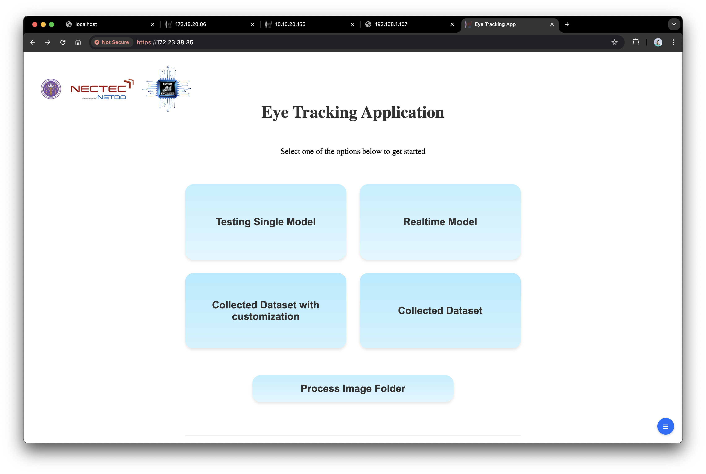
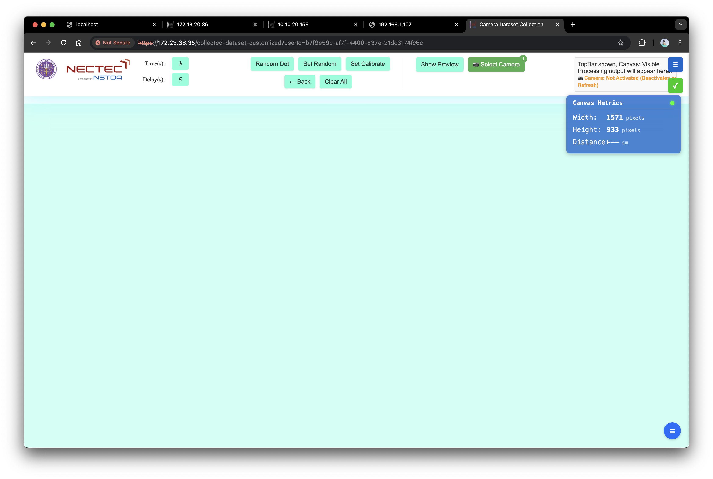
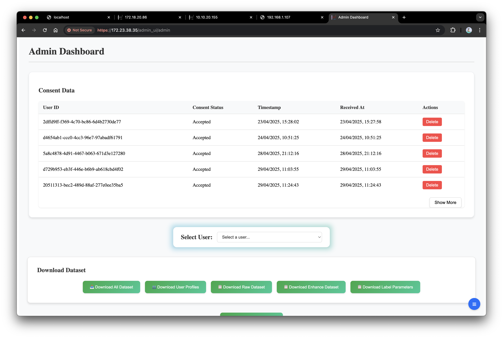
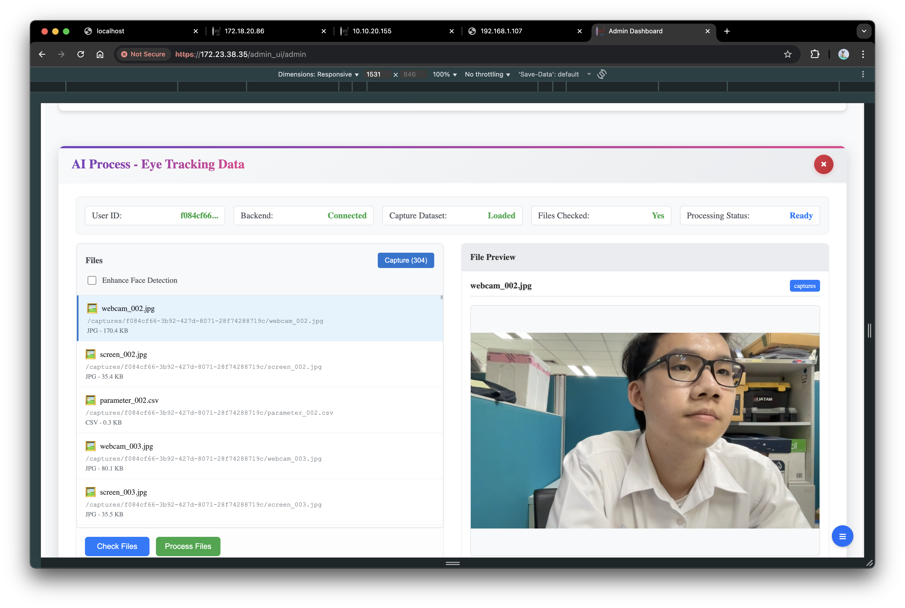

# Eye Tracking Web Application

A comprehensive web-based eye tracking system built with Next.js frontend and Python backend services, featuring real-time face detection, head pose estimation, and image enhancement capabilities.

## 🏗️ Architecture Overview

The application follows a microservices architecture with the following components:

### Frontend (Next.js)
- **Port**: 3010
- **Technology**: Next.js 15.5.3 with React
- **Node.js**: v23.11.0
- **Features**: Real-time eye tracking interface, data collection, admin dashboard
- **Key Pages**:
  - `/` - Home page with consent management
  - `/collected-dataset` - Basic data collection interface
  - `/collected-dataset-customized` - Advanced data collection with canvas
  - `/testing-image` - AI model testing interface
  - `/admin_ui/` - Administrative dashboard

### Backend Services

#### 1. Auth Service (Port 8108)
- **Purpose**: User authentication, data management, consent handling
- **Database**: MongoDB
- **Key Features**:
  - User registration and authentication
  - Consent data management
  - User preferences storage
  - Data centralization
  - Canvas configuration management

#### 2. Image Service (Port 8010)
- **Purpose**: Image processing and AI model inference
- **Key Features**:
  - Face detection and landmark extraction
  - Head pose estimation
  - Image enhancement using Real-ESRGAN
  - Batch processing capabilities

#### 3. Video Service (Port 8011)
- **Purpose**: Real-time video processing and analysis
- **Key Features**:
  - Real-time video stream processing
  - Video-based eye tracking analysis
  - Continuous frame processing
  - Video enhancement capabilities
- **Status**: Currently unavailable (under development)

#### 4. Nginx Reverse Proxy (Ports 80, 443, 8443)
- **Purpose**: Load balancing, SSL termination, security headers
- **Features**:
  - HTTPS redirection
  - Rate limiting
  - CORS handling
  - Security headers (CSP, HSTS, etc.)
  - Camera access control via port separation

## 📁 Storage System (`resource_security/`)

The application uses a centralized storage system located at `backend/auth_service/resource_security/`:

### Directory Structure

```
resource_security/
├── canvas/                          # Canvas background images
│   ├── config.json                 # Canvas configuration
│   └── *.jpg, *.png               # Background images
├── consent_data.json               # User consent records
├── data_centralization/            # Centralized user data
│   ├── data_centralization_data.json
│   └── [user-id].json             # Individual user data
├── public/                         # Public file storage
│   ├── captures/                   # User capture sessions
│   │   └── [session-id]/          # Individual session data
│   │       ├── screen_*.jpg       # Screen captures
│   │       ├── webcam_*.jpg       # Webcam captures
│   │       ├── parameter_*.csv    # Eye tracking parameters
│   │       └── metadata.json      # Session metadata
│   ├── enhance/                    # Enhanced images
│   └── complete/                   # Processed complete datasets
└── user_preferences/               # User-specific settings
    ├── user_preferences_data.json
    └── [user-id].json             # Individual user preferences
```

### Data Flow

1. **User Registration**: Creates user ID and initial preferences
2. **Data Collection**: Stores captures in `public/captures/[session-id]/`
3. **Processing**: Images moved to `enhance/` for AI processing
4. **Completion**: Final datasets stored in `complete/`
5. **Centralization**: Data aggregated in `data_centralization/`

## 📋 Technical Requirements

For detailed technical specifications, system requirements, and configuration details, please refer to:

**[📋 Requirements.md](Requirements.md)** - Complete technical documentation including:
- AI model weights and structure
- SSL configuration and setup
- Port configurations and networking
- Storage system requirements
- Security specifications
- Performance requirements
- Troubleshooting guides

## 🖼️ Application Screenshots

<div align="center">

| Home Page | Data Collection Interface |
|-----------|---------------------------|
|  |  |
| *Main application home page with consent management and user interface* | *Advanced data collection interface with real-time eye tracking capabilities* |

| Admin Dashboard | Admin with AI Enhancement |
|-----------------|---------------------------|
|  |  |
| *Administrative dashboard for managing users, datasets, and system configuration* | *Admin interface with AI enhancement features and processing capabilities* |

</div>

## 🚀 Quick Start

### Prerequisites
- Docker Compose v2.39.2-desktop.1
- OpenSSL 3.5.2 (for SSL certificates)
- Node.js v23.11.0 (for development)
- Next.js 15.5.3
- MongoDB v8.0.8

### 1. Clone and Setup
```bash
git clone <repository-url>
cd Main_web_eyetracking
```

### 2. Configure Server IP for Multi-User Access

**IMPORTANT**: Before running the application, you must configure the server IP address in the nginx configuration to allow multiple users to access the application.

#### Step 2a: Update nginx.conf with your server IP
```bash
# Edit the nginx configuration file
nano Main-website/backend/config/nginx.conf
```

Find and update the `server_name` directives in both HTTP and HTTPS server blocks:

```nginx
# HTTP server block (around line 91)
server_name YOUR_SERVER_IP localhost;

# HTTPS server block (around line 115) 
server_name YOUR_SERVER_IP localhost;

# HTTPS camera access server block (around line 428)
server_name YOUR_SERVER_IP localhost;
```

Replace `YOUR_SERVER_IP` with your actual server IP address (e.g., `192.168.1.100`, `10.0.0.50`, etc.)

#### Step 2b: Generate SSL Certificates with Server IP
```bash
# Development with server IP
mkdir -p Main-website/backend/config/ssl
openssl req -x509 -newkey rsa:2048 \
    -keyout Main-website/backend/config/ssl/key.pem \
    -out Main-website/backend/config/ssl/cert.pem \
    -days 365 -nodes \
    -subj "/CN=YOUR_SERVER_IP" \
    -addext "subjectAltName=DNS:localhost,IP:127.0.0.1,IP:YOUR_SERVER_IP"
```

Replace `YOUR_SERVER_IP` with your actual server IP address.

> **📋 For detailed SSL configuration and certificate generation explanation, see [Requirements.md](Requirements.md)**

### 3. Configure Environment
```bash
# Copy environment files
touch Main-website/backend/.env.backend
touch Main-website/frontend/.env.frontend

# Edit configuration files
nano Main-website/backend/.env.backend
nano Main-website/frontend/.env.frontend
```

### 4. Start Services
```bash
# Start all services
cd Main-website
docker-compose up -d

# Check service status
docker-compose ps

# View logs
docker-compose logs -f
```

### 5. Access Application

#### Multi-User Access URLs
Replace `YOUR_SERVER_IP` with your configured server IP address:

- **Main Application**: `https://YOUR_SERVER_IP` (port 443)
- **Camera Access**: `https://YOUR_SERVER_IP:8443` (port 8443)
- **HTTP Redirect**: `http://YOUR_SERVER_IP` → `https://YOUR_SERVER_IP`

#### Local Development Access
- **Direct Frontend**: `http://localhost:3010` (Next.js development server)
- **Main Application**: `https://localhost` (port 443 - via nginx)
- **Camera Access**: `https://localhost:8443` (port 8443 - via nginx)
- **HTTP Redirect**: `http://localhost` → `https://localhost`

#### Example with IP 192.168.1.100
- **Main Application**: `https://192.168.1.100`
- **Camera Access**: `https://192.168.1.100:8443`
- **HTTP Redirect**: `http://192.168.1.100` → `https://192.168.1.100`

#### Access Methods Summary
| Access Type | URL | Port | Description |
|-------------|-----|------|-------------|
| **Multi-User HTTPS** | `https://YOUR_SERVER_IP` | 443 | Full application via nginx (recommended) |
| **Multi-User Camera** | `https://YOUR_SERVER_IP:8443` | 8443 | Camera access via nginx |
| **Local Development** | `http://localhost:3010` | 3010 | Direct Next.js dev server |
| **Local HTTPS** | `https://localhost` | 443 | Local application via nginx |

## 👥 Multi-User Deployment

### Network Configuration
For multi-user access, ensure your server is accessible from other devices on the network:

1. **Firewall Configuration**: Open ports 80, 443, and 8443
2. **Network Access**: Ensure devices can reach the server IP
3. **SSL Certificates**: Include server IP in certificate SAN (Subject Alternative Name)

### Security Considerations
- **Rate Limiting**: Configured in nginx.conf to prevent abuse
- **User Isolation**: Each user gets separate data directories
- **Session Management**: JWT-based authentication with proper expiration
- **Data Privacy**: User data is isolated and encrypted

### Scaling for Multiple Users
- **Concurrent Users**: System supports multiple simultaneous users
- **Resource Management**: Each user session is managed independently
- **Data Storage**: User data is stored in separate directories under `resource_security/`

## 🔧 Quick Configuration Reference

### Essential Configuration Files
- **Docker Compose**: `Main-website/docker-compose.yml`
- **Nginx Config**: `Main-website/backend/config/nginx.conf`
- **MongoDB Config**: `Main-website/backend/config/mongod.conf`

### Key Data Formats
- **Images**: JPG format for captures
- **Parameters**: CSV format for eye tracking data
- **Metadata**: JSON format for session information

> **📋 For complete configuration details, troubleshooting, and technical specifications, see [Requirements.md](Requirements.md)**

## 📚 Documentation

- **📋 Technical Requirements**: [Requirements.md](Requirements.md) - Complete technical specifications and configuration details
- **Environment Setup**: [Main-website/ENVIRONMENT_SETUP.md](Main-website/ENVIRONMENT_SETUP.md)
- **SSL Setup**: [Main-website/backend/config/SSL_SETUP_README.md](Main-website/backend/config/SSL_SETUP_README.md)
- **Camera Setup**: [Main-website/backend/config/HTTPS_CAMERA_SETUP.md](Main-website/backend/config/HTTPS_CAMERA_SETUP.md)
- **Consent System**: [Main-website/backend/auth_service/CONSENT_INITIALIZATION_README.md](Main-website/backend/auth_service/CONSENT_INITIALIZATION_README.md)
- **Admin Download**: [Main-website/backend/auth_service/routes/ADMIN_DOWNLOAD_README.md](Main-website/backend/auth_service/routes/ADMIN_DOWNLOAD_README.md)
- **Process Set**: [Main-website/frontend/pages/process_set/README.md](Main-website/frontend/pages/process_set/README.md)
- **Dataset Processing**: [Main-website/frontend/pages/api/for-process-folder/readDataset/README.md](Main-website/frontend/pages/api/for-process-folder/readDataset/README.md)

## 📚 Key Dependencies and References

This project relies on several open-source libraries and frameworks:

### AI/ML Libraries
- **[Real-ESRGAN](https://github.com/xinntao/Real-ESRGAN)**: Used for image super-resolution and enhancement. Real-ESRGAN aims at developing Practical Algorithms for General Image/Video Restoration with 32.5k+ GitHub stars.
- **[MediaPipe](https://ai.google.dev/edge/mediapipe/solutions/guide)**: Google's framework for building machine learning pipelines, used for facial landmark detection and head pose estimation in our eye tracking system.

### Core Technologies
- **Next.js**: React framework for the frontend application
- **FastAPI**: Python web framework for backend services
- **MongoDB**: NoSQL database for user data and session management
- **Docker**: Containerization for microservices architecture
- **Nginx**: Reverse proxy and load balancer

## 🤗 Acknowledgement

Thanks for all the contributors and the open-source community.

### External Libraries
- **Real-ESRGAN Team**: For providing an excellent image super-resolution library
- **Google MediaPipe Team**: For the comprehensive facial landmark detection framework
- **Next.js Team**: For the robust React framework
- **FastAPI Team**: For the high-performance Python web framework

## 🤝 Contributing

1. Fork the repository
2. Create a feature branch
3. Make your changes
4. Test thoroughly
5. Submit a pull request

## 📄 License

This project is licensed under the MIT License - see the LICENSE file for details.

## 🆘 Support

For support and questions:
- Create an issue in the repository
- Check the troubleshooting section
- Review the documentation files
- Contact the development team

---

**Note**: This application handles sensitive biometric data. Ensure compliance with local privacy laws and regulations when deploying in production environments.
