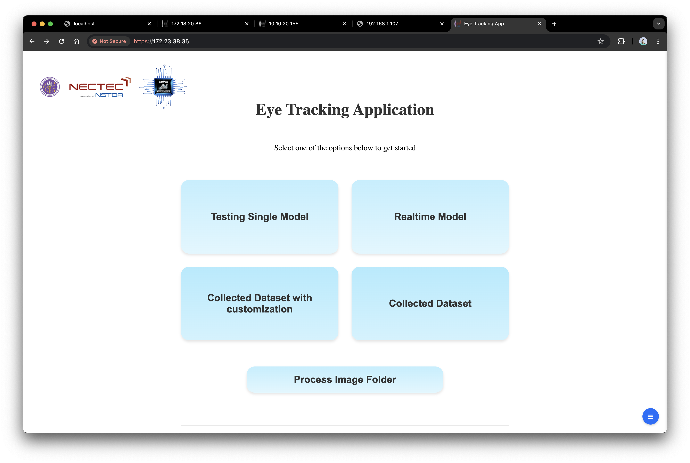
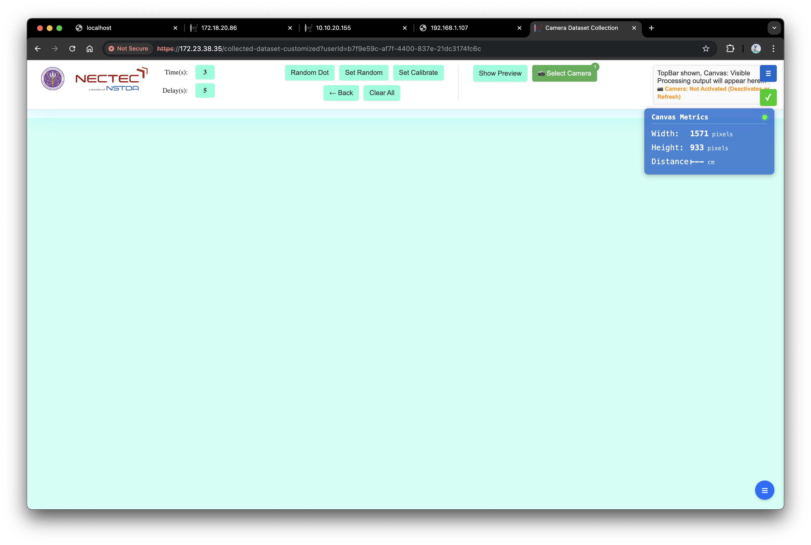
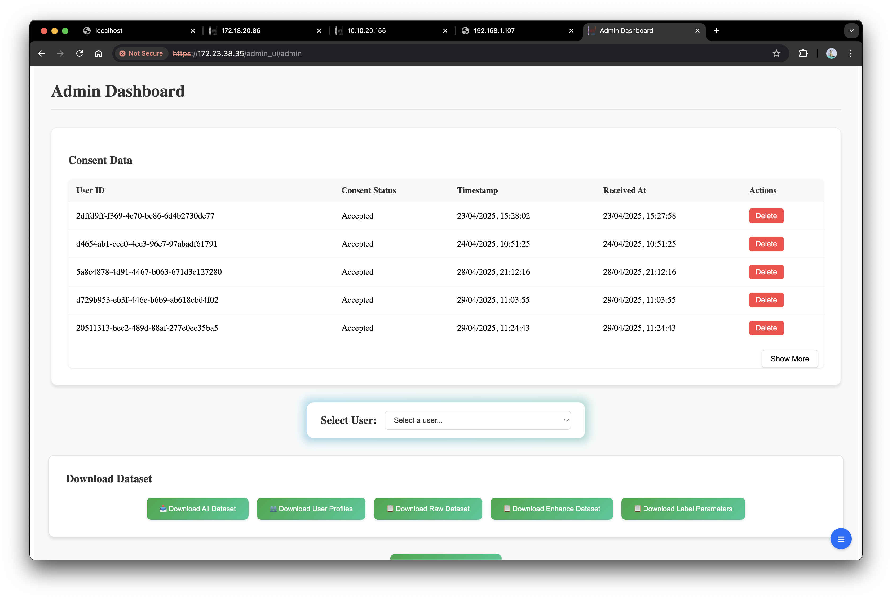
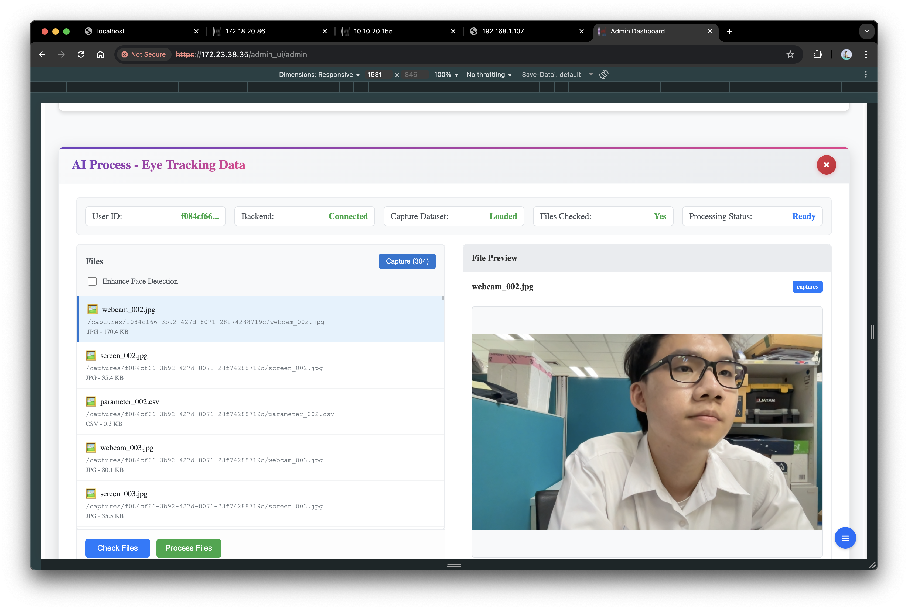

# Eye Tracking Web Application

A comprehensive web-based eye tracking system built with Next.js frontend and Python backend services, featuring real-time face detection, head pose estimation, and image enhancement capabilities. **Note**: This website is designed for collecting datasets only. The video processing service is currently under development.

*Developed under NECTEC IPU Lab (National Electronics and Computer Technology Center - IPU Laboratory), Thailand.*

## ⚠️ Important Notice

**This website is designed for collecting datasets only.** The following features are currently unavailable or under development:

- **Video Processing Service (Port 8011)**: Currently under development and not available
- **Image Background Auto-Change**: This feature is temporarily unavailable and will be restored in future updates

Please use the available data collection features for your research needs.

## 🏗️ Architecture Overview

The application follows a microservices architecture with the following components:

### Frontend (Next.js)
- **Port**: 3010
- **Technology**: Next.js 15.5.3 with React
- **Node.js**: v23.11.0
- **Features**: Real-time eye tracking interface, data collection, admin dashboard
- **Key Pages**:
  - `/` - Home page with consent management
  - `/collected-dataset` - Basic data collection interface
  - `/collected-dataset-customized` - Advanced data collection with canvas
  - `/testing-image` - AI model testing interface
  - `/admin_ui/` - Administrative dashboard

### Backend Services

#### 1. Auth Service (Port 8108)
- **Purpose**: User authentication, data management, consent handling
- **Database**: MongoDB
- **Key Features**:
  - User registration and authentication
  - Consent data management
  - User preferences storage
  - Data centralization
  - Canvas configuration management

#### 2. Image Service (Port 8010)
- **Purpose**: Image processing and AI model inference
- **Key Features**:
  - Face detection and landmark extraction
  - Head pose estimation
  - Image enhancement using Real-ESRGAN
  - Batch processing capabilities

#### 3. Video Service (Port 8011) ⚠️ **CURRENTLY UNAVAILABLE**
- **Purpose**: Real-time video processing and analysis
- **Key Features**:
  - Real-time video stream processing
  - Video-based eye tracking analysis
  - Continuous frame processing
  - Video enhancement capabilities
- **Status**: 🚧 **UNDER DEVELOPMENT** - This service is not yet implemented and will be available in future releases

#### 4. Nginx Reverse Proxy (Ports 9080, 9443, 9444)
- **Purpose**: Load balancing, SSL termination, security headers
- **Features**:
  - HTTPS redirection (dynamic based on request hostname)
  - Rate limiting
  - CORS handling
  - Security headers (CSP, HSTS, etc.)
  - Camera access control via port separation
  - **Dynamic Configuration**: No hardcoded IPs - works with any server IP/hostname
  - **Container Name Routing**: Uses Docker DNS for internal service communication
  - **Multi-Network Support**: Internal network + external nginx proxy network

## 📁 Storage System (`resource_security/`)

The application uses a centralized storage system located at `backend/auth_service/resource_security/`:

### Directory Structure

```
resource_security/
├── canvas/                          # Canvas background images
│   ├── config.json                 # Canvas configuration
│   └── *.jpg, *.png               # Background images
├── consent_data.json               # User consent records
├── data_centralization/            # Centralized user data
│   ├── data_centralization_data.json
│   └── [user-id].json             # Individual user data
├── public/                         # Public file storage
│   ├── captures/                   # User capture sessions
│   │   └── [session-id]/          # Individual session data
│   │       ├── screen_*.jpg       # Screen captures
│   │       ├── webcam_*.jpg       # Webcam captures
│   │       ├── parameter_*.csv    # Eye tracking parameters
│   │       └── metadata.json      # Session metadata
│   ├── enhance/                    # Enhanced images
│   └── complete/                   # Processed complete datasets
└── user_preferences/               # User-specific settings
    ├── user_preferences_data.json
    └── [user-id].json             # Individual user preferences
```

### Data Flow

1. **User Registration**: Creates user ID and initial preferences
2. **Data Collection**: Stores captures in `public/captures/[session-id]/`
3. **Processing**: Images moved to `enhance/` for AI processing
4. **Completion**: Final datasets stored in `complete/`
5. **Centralization**: Data aggregated in `data_centralization/`

## 📋 Technical Requirements

For detailed technical specifications, system requirements, and configuration details, please refer to:

**[📋 Requirements.md](Requirements.md)** - Complete technical documentation including:
- AI model weights and structure
- SSL configuration and setup
- Port configurations and networking
- Storage system requirements
- Security specifications
- Performance requirements
- Troubleshooting guides

## 🖼️ Application Screenshots

<div align="center">

| Home Page | Data Collection Interface |
|-----------|---------------------------|
|  |  |
| *Main application home page with consent management and user interface* | *Advanced data collection interface with real-time eye tracking capabilities* |

| Admin Dashboard | Admin with AI Enhancement |
|-----------------|---------------------------|
|  |  |
| *Administrative dashboard for managing users, datasets, and system configuration* | *Admin interface with AI enhancement features and processing capabilities* |

</div>

## 🚀 Quick Start

### Prerequisites
- Docker Compose v2.39.2-desktop.1
- OpenSSL 3.5.2 (for SSL certificates)
- Node.js v23.11.0 (for development)
- Next.js v16.0.0
- MongoDB v8.0.8

### 1. Clone and Setup
```bash
git clone https://github.com/porchportal/Main_Web_EyeTracking.git
cd Main_web_eyetracking
```

### 2. Generate SSL Certificates

**Quick Setup**: Generate self-signed SSL certificates for HTTPS:

```bash
# One-liner to create SSL certificates
mkdir -p Main-website/backend/config/ssl && cd Main-website/backend/config/ssl && \
openssl req -x509 -newkey rsa:2048 -keyout key.pem -out cert.pem -days 365 -nodes \
-subj "/CN=localhost" -addext "subjectAltName=DNS:localhost,IP:127.0.0.1" && \
chmod 600 key.pem && chmod 644 cert.pem && cd ../..
```

> **🔐 For complete SSL setup instructions, production certificates, and troubleshooting, see:**
> **[SSL_SETUP_README.md](Main-website/backend/config/SSL_SETUP_README.md)**

### 3. Setup Docker Network (for external nginx integration)

If you have an external nginx proxy that needs to communicate with this project:

```bash
# Create external network (run once)
docker network create nginx_proxy
```

Skip this step if you're not using an external nginx proxy.

### 4. Configure Environment
```bash
# Copy environment files
touch Main-website/backend/.env.backend
touch Main-website/frontend/.env.frontend

# Edit configuration files
nano Main-website/backend/.env.backend
nano Main-website/frontend/.env.frontend
```

### 5. Start Services

**Security Note**: All containers run as non-root users for enhanced security. Files created by containers will be owned by your user.

```bash
cd Main-website

# Use the docker-run.sh helper script (automatically sets UID/GID)
./docker-run.sh up --build -d

# Or manually export user ID before running docker-compose
export UID=$(id -u)
export GID=$(id -g)
docker-compose up --build -d

# Check service status
./docker-run.sh ps
# or: docker-compose ps

# View logs
./docker-run.sh logs -f
# or: docker-compose logs -f

# Stop services
./docker-run.sh down
# or: docker-compose down
```

### 6. Access Application

**Dynamic URL Access**: The application works with **any** server IP or hostname - no configuration needed!

#### Access URLs
Replace `YOUR_SERVER_IP` with your actual server IP address:

- **Main Application**: `https://YOUR_SERVER_IP:9443` or `https://localhost:9443`
- **Camera Access**: `https://YOUR_SERVER_IP:9444` or `https://localhost:9444`
- **HTTP Redirect**: `http://YOUR_SERVER_IP:9080` → `https://YOUR_SERVER_IP:9443`

#### Example Access
- With IP `192.168.1.100`: `https://192.168.1.100:9443`
- With IP `10.0.0.50`: `https://10.0.0.50:9443`
- Localhost: `https://localhost:9443`

#### Access Methods Summary
| Access Type | URL Pattern | Port | Description |
|-------------|-------------|------|-------------|
| **HTTPS Main** | `https://<any-ip>:9443` | 9443 | Main application (dynamic) |
| **HTTPS Camera** | `https://<any-ip>:9444` | 9444 | Camera access (dynamic) |
| **HTTP Redirect** | `http://<any-ip>:9080` | 9080 | Redirects to HTTPS |
| **Direct Frontend** | `http://localhost:3010` | 3010 | Next.js dev server (development) |

## 👥 Multi-User Deployment

### Network Configuration
For multi-user access, ensure your server is accessible from other devices on the network:

1. **Firewall Configuration**: Open ports 9080, 9443, and 9444
2. **Network Access**: Ensure devices can reach the server IP
3. **SSL Certificates**: Self-signed certificates will show browser warnings (expected for development)
4. **Dynamic Configuration**: No need to update nginx.conf - it works with any IP automatically

### Security Considerations
- **Rate Limiting**: Configured in nginx.conf to prevent abuse
- **User Isolation**: Each user gets separate data directories
- **Session Management**: JWT-based authentication with proper expiration
- **Data Privacy**: User data is isolated and encrypted

### Scaling for Multiple Users
- **Concurrent Users**: System supports multiple simultaneous users
- **Resource Management**: Each user session is managed independently
- **Data Storage**: User data is stored in separate directories under `resource_security/`

## 🔧 Quick Configuration Reference

### Essential Configuration Files
- **Docker Compose**: `Main-website/docker-compose.yml`
- **Nginx Config**: `Main-website/backend/config/nginx.conf`
- **MongoDB Config**: `Main-website/backend/config/mongod.conf`

### Key Data Formats
- **Images**: JPG format for captures
- **Parameters**: CSV format for eye tracking data
- **Metadata**: JSON format for session information

> **📋 For complete configuration details, troubleshooting, and technical specifications, see [Requirements.md](Requirements.md)**

## 📚 Documentation

- **📋 Technical Requirements**: [Requirements.md](Requirements.md) - Complete technical specifications and configuration details
- **🏗️ Architecture & API Flow**: [ARCHITECTURE_SEQUENCE_DIAGRAM.md](ARCHITECTURE_SEQUENCE_DIAGRAM.md) - Comprehensive time sequence diagram showing service interactions and API flow
- **Environment Setup**: [Main-website/ENVIRONMENT_SETUP.md](Main-website/ENVIRONMENT_SETUP.md)
- **SSL & Camera Setup**: [Main-website/backend/config/SSL_SETUP_README.md](Main-website/backend/config/SSL_SETUP_README.md) - Comprehensive SSL and HTTPS camera access guide
- **Consent System**: [Main-website/backend/auth_service/CONSENT_INITIALIZATION_README.md](Main-website/backend/auth_service/CONSENT_INITIALIZATION_README.md)
- **Admin Download**: [Main-website/backend/auth_service/routes/ADMIN_DOWNLOAD_README.md](Main-website/backend/auth_service/routes/ADMIN_DOWNLOAD_README.md)
- **Process Set**: [Main-website/frontend/pages/process_set/README.md](Main-website/frontend/pages/process_set/README.md)
- **Dataset Processing**: [Main-website/frontend/pages/api/for-process-folder/readDataset/README.md](Main-website/frontend/pages/api/for-process-folder/readDataset/README.md)

## 📚 Key Dependencies and References

This project relies on several open-source libraries and frameworks:

### AI/ML Libraries
- **[Real-ESRGAN](https://github.com/xinntao/Real-ESRGAN)**: Used for image super-resolution and enhancement. Real-ESRGAN aims at developing Practical Algorithms for General Image/Video Restoration with 32.5k+ GitHub stars.
- **[MediaPipe](https://ai.google.dev/edge/mediapipe/solutions/guide)**: Google's framework for building machine learning pipelines, used for facial landmark detection and head pose estimation in our eye tracking system.

### Core Technologies
- **Next.js**: React framework for the frontend application
- **FastAPI**: Python web framework for backend services
- **MongoDB**: NoSQL database for user data and session management
- **Docker**: Containerization for microservices architecture
- **Nginx**: Reverse proxy and load balancer

## 🏛️ Institutional Affiliation

This project is developed under the **NECTEC IPU Lab** (National Electronics and Computer Technology Center - IPU Laboratory), Thailand. The research and development of this eye tracking system is part of ongoing work in computer vision and human-computer interaction technologies.

## 🤝 Contributing

1. Fork the repository
2. Create a feature branch
3. Make your changes
4. Test thoroughly
5. Submit a pull request

## 📄 License

This project is licensed under the MIT License - see the LICENSE file for details.

## 🆘 Support

For support and questions:
- Create an issue in the repository
- Check the troubleshooting section
- Review the documentation files
- Contact the development team(me)

---

**Note**: This application handles sensitive biometric data. Ensure compliance with local privacy laws and regulations when deploying in production environments.
